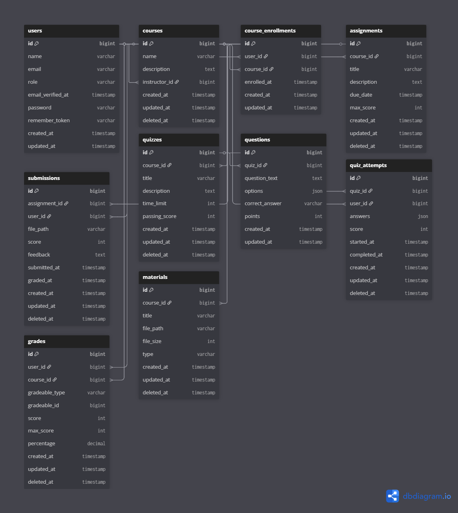

# aku dan laravel

## Project Overview

**Nama Project:** LMS Mini - Cache Strategy Benchmarking

**Tujuan:** Menganalisis dan membandingkan strategi caching (Cache-Aside, Read-Through, Write-Through) pada Laravel Cache Abstraction Layer untuk optimasi performa data layer sistem pembelajaran.

---

## Tech Stack

| Layer         | Technology            | Version |
| ------------- | --------------------- | ------- |
| Framework     | Laravel               | 12.x    |
| PHP           | PHP                   | 8.2+    |
| Database      | MySQL                 | 8.0+    |
| Cache Backend | Redis                 | 7.x     |
| Development   | Laravel Sail (Docker) | Latest  |
| Load Testing  | Grafana K6            | Latest  |
| API Format    | REST JSON             | -       |

---

## Architecture Overview

### Caching Strategy Pattern

```
┌─────────────────────────────────────────────────────────────┐
│                      API Request                            │
└─────────────────────────┬───────────────────────────────────┘
                          │
                          ▼
┌─────────────────────────────────────────────────────────────┐
│                    Controller                               │
└─────────────────────────┬───────────────────────────────────┘
                          │
                          ▼
┌─────────────────────────────────────────────────────────────┐
│                 Cache Service Layer                         │
│  ┌─────────────────────────────────────────────────────┐    │
│  │           CacheStrategyInterface                    │    │
│  │  - get(key): mixed                                  │    │
│  │  - put(key, value, ttl): bool                       │    │
│  │  - forget(key): bool                                │    │
│  │  - remember(key, ttl, callback): mixed              │    │
│  └─────────────────────────────────────────────────────┘    │
│           ▲              ▲             ▲             ▲      │
│           │              │             │             │      │
│  ┌────────┴────┐ ┌───────┴─────┐ ┌─────┴───────┐ ┌───┴────┐ │
│  │Cache-Aside  │ │Read-Through │ │Write-Through│ │No-Cache│ │
│  │  Strategy   │ │  Strategy   │ │  Strategy   │ │Strategy│ │
│  └─────────────┘ └─────────────┘ └─────────────┘ └────────┘ │
└─────────────────────────┬───────────────────────────────────┘
                          │
          ┌───────────────┼──────────────┐
          ▼               ▼              ▼
    ┌──────────┐   ┌──────────┐   ┌──────────┐
    │  Redis   │   │  MySQL   │   │  Redis   │
    │  Cache   │   │ Database │   │  Cache   │
    └──────────┘   └──────────┘   └──────────┘
```

### Strategy Switching (Config-Based)

```env
# .env
CACHE_STRATEGY=cache-aside  # Options: cache-aside, read-through, write-through, no-cache
CACHE_DRIVER=redis
CACHE_TTL=3600
```

---

## Project Structure

```
lms/
├── app/
│   ├── Constants/
│   │   ├── ResponseMessage.php
│   │   └── Messages/
│   │       ├── AssignmentMessage.php
│   │       ├── GradeMessage.php
│   │       ├── MaterialMessage.php
│   │       └── QuizMessage.php
│   ├── Contracts/
│   │   ├── CacheStrategyInterface.php
│   │   └── RepositoryInterface.php
│   ├── Exceptions/
│   │   └── BusinessException.php
│   ├── Services/
│   │   ├── Cache/
│   │   │   ├── CacheAsideStrategy.php
│   │   │   ├── ReadThroughStrategy.php
│   │   │   ├── WriteThroughStrategy.php
│   │   │   └── NoCacheStrategy.php
│   │   ├── QuizService.php
│   │   ├── MaterialService.php
│   │   ├── AssignmentService.php
│   │   ├── GradebookService.php
│   │   └── QuizScoringService.php
│   ├── Repositories/
│   │   ├── BaseRepository.php
│   │   ├── QuizRepository.php
│   │   ├── MaterialRepository.php
│   │   ├── AssignmentRepository.php
│   │   ├── SubmissionRepository.php
│   │   ├── QuizAttemptRepository.php
│   │   └── GradeRepository.php
│   ├── Http/
│   │   ├── Controllers/
│   │   │   ├── Controller.php
│   │   │   └── Api/
│   │   │       ├── QuizController.php
│   │   │       ├── MaterialController.php
│   │   │       ├── AssignmentController.php
│   │   │       └── GradebookController.php
│   │   ├── Controllers/Traits/
│   │   │   └── ApiResponseTrait.php
│   │   └── Requests/
│   │       ├── StoreMaterialRequest.php
│   │       ├── UpdateMaterialRequest.php
│   │       ├── SubmitAssignmentRequest.php
│   │       ├── GradeSubmissionAssignmentRequest.php
│   │       ├── StartAttemptQuizRequest.php
│   │       ├── SubmitAttemptQuizRequest.php
│   │       └── UpdateGradebookRequest.php
│   ├── Models/
│   │   ├── User.php
│   │   ├── Course.php
│   │   ├── Quiz.php
│   │   ├── Question.php
│   │   ├── QuizAttempt.php
│   │   ├── Material.php
│   │   ├── Assignment.php
│   │   ├── Submission.php
│   │   ├── Grade.php
│   │   └── CourseEnrollment.php
│   └── Providers/
│       ├── AppServiceProvider.php
│       ├── CacheStrategyServiceProvider.php
│       └── TelescopeServiceProvider.php
├── config/
│   └── caching-strategy.php
├── database/
│   ├── migrations/
│   ├── seeders/
│   │   ├── DatabaseSeeder.php
│   │   ├── UserSeeder.php
│   │   ├── CourseSeeder.php
│   │   ├── QuizSeeder.php
│   │   ├── MaterialSeeder.php
│   │   └── AssignmentSeeder.php
│   └── factories/
├── routes/
│   └── api.php
├── tests/
│   ├── Feature/
│   │   └── Api/
│   └── Benchmark/
│       └── k6/
├── compose.yml
└── .env.example
```

---

## Database Schema

### ERD Overview



### Data Seeding Specification

| Entity        | Count  | Notes                             |
| ------------- | ------ | --------------------------------- |
| Users         | 5,000  | 4,900 students, 100 instructors   |
| Courses       | 50     | ~100 students per course          |
| Enrollments   | ~5,000 | Random distribution               |
| Quizzes       | 250    | 5 per course                      |
| Questions     | 5,000  | 20 per quiz                       |
| Quiz Attempts | 25,000 | ~5 attempts per quiz              |
| Materials     | 500    | 10 per course                     |
| Assignments   | 250    | 5 per course                      |
| Submissions   | 12,500 | ~50 per assignment                |
| Grades        | 37,500 | Combined quiz + assignment grades |

---

## Caching Strategy Implementation

### 1. Cache-Aside (Lazy Loading)

```php
public function get(string $key, callable $callback): mixed
{
    if ($cached = Cache::get($key)) {
        return $cached;
    }

    $value = $callback();
    Cache::put($key, $value, $this->ttl);

    return $value;
}

public function put(string $key, mixed $value): bool
{
    return Cache::forget($key);
}
```

### 2. Read-Through

```php
public function get(string $key, callable $dataSource): mixed
{
    return Cache::remember($key, $this->ttl, $dataSource);
}
```

### 3. Write-Through

```php
public function put(string $key, mixed $value, callable $persist): bool
{
    $persist($value);
    Cache::put($key, $value, $this->ttl);
    return true;
}
```

---

## API Endpoints

### Quiz Module (Read-Heavy)

| Method | Endpoint                                        | Description                    | Cache Behavior     |
| ------ | ----------------------------------------------- | ------------------------------ | ------------------ |
| GET    | `/api/quizzes`                                  | List all quizzes               | Cached             |
| GET    | `/api/quizzes/{id}`                             | Get quiz detail with questions | Cached             |
| GET    | `/api/quizzes/{id}/questions`                   | Get questions for quiz         | Cached             |
| POST   | `/api/quizzes/{id}/attempts`                    | Start quiz attempt             | Write              |
| PUT    | `/api/quizzes/{id}/attempts/{attemptId}`        | Submit quiz answers            | Write + Invalidate |
| GET    | `/api/quizzes/{id}/attempts/{attemptId}/result` | Get attempt result             | Cached             |
| GET    | `/api/users/{userId}/quiz-attempts`             | Get user's quiz attempts       | Cached             |

### Material Module (Read-Heavy)

| Method | Endpoint                       | Description            | Cache Behavior     |
| ------ | ------------------------------ | ---------------------- | ------------------ |
| GET    | `/api/courses/{id}/materials`  | List course materials  | Cached             |
| GET    | `/api/materials/{id}`          | Get material detail    | Cached             |
| GET    | `/api/materials/{id}/download` | Download material file | Cached metadata    |
| POST   | `/api/materials`               | Upload new material    | Write + Invalidate |
| PUT    | `/api/materials/{id}`          | Update material        | Write + Invalidate |
| DELETE | `/api/materials/{id}`          | Delete material        | Write + Invalidate |

### Assignment Module (Write-Heavy)

| Method | Endpoint                                    | Description                   | Cache Behavior     |
| ------ | ------------------------------------------- | ----------------------------- | ------------------ |
| GET    | `/api/courses/{id}/assignments`             | List assignments              | Cached             |
| GET    | `/api/assignments/{id}`                     | Get assignment detail         | Cached             |
| POST   | `/api/assignments/{id}/submissions`         | Submit assignment             | Write              |
| GET    | `/api/assignments/{id}/submissions`         | List submissions (instructor) | Cached             |
| GET    | `/api/assignments/{id}/submissions/pending` | List pending submissions      | Cached             |
| GET    | `/api/assignments/{id}/statistics`          | Get assignment statistics     | Cached             |
| PUT    | `/api/submissions/{id}/grade`               | Grade submission              | Write + Invalidate |

### Gradebook Module (Mixed)

| Method | Endpoint                                  | Description              | Cache Behavior      |
| ------ | ----------------------------------------- | ------------------------ | ------------------- |
| GET    | `/api/courses/{id}/gradebook`             | Get course gradebook     | Cached (aggregated) |
| GET    | `/api/users/{id}/grades`                  | Get user's all grades    | Cached              |
| GET    | `/api/courses/{id}/users/{userId}/grades` | Get user grade in course | Cached              |
| PUT    | `/api/grades/{id}`                        | Update grade             | Write + Invalidate  |
| GET    | `/api/courses/{id}/statistics`            | Get course statistics    | Cached              |
| GET    | `/api/users/{id}/performance`             | Get user performance     | Cached              |
| GET    | `/api/courses/{id}/top-performers`        | Get top performers       | Cached              |

---

## Benchmark Scenarios

### Environment Specification

| Component | Specification    |
| --------- | ---------------- |
| VPS       | 2 vCPU, 2GB RAM  |
| OS        | Ubuntu 22.04 LTS |
| Docker    | Latest           |
| PHP       | 8.2 (FPM)        |
| MySQL     | 8.0              |
| Redis     | 7.x              |

### Workload Scenarios

#### Scenario 1: Read-Heavy (80% Read, 20% Write)

```
Concurrent Users: 100, 250, 500, 750, 1000
Duration: 5 minutes per test
Ramp-up: 60 seconds

Operations:
- 40% GET /api/quizzes/{id}
- 25% GET /api/materials/{id}
- 15% GET /api/courses/{id}/gradebook
- 10% POST /api/quizzes/{id}/attempts
- 10% POST /api/assignments/{id}/submissions
```

#### Scenario 2: Write-Heavy (40% Read, 60% Write)

```
Concurrent Users: 100, 250, 500, 750, 1000
Duration: 5 minutes per test
Ramp-up: 60 seconds

Operations:
- 20% GET /api/assignments/{id}
- 20% GET /api/courses/{id}/gradebook
- 35% POST /api/assignments/{id}/submissions
- 15% PUT /api/submissions/{id}/grade
- 10% POST /api/quizzes/{id}/attempts
```

### Metrics to Collect

| Category        | Metric                       | Tool      | Command/Method     |
| --------------- | ---------------------------- | --------- | ------------------ |
| Response Time   | Avg, Min, Max, P90, P95, P99 | K6        | Aggregate Report   |
| Throughput      | Requests/second              | K6        | Aggregate Report   |
| Error Rate      | % Failed requests            | K6        | Aggregate Report   |
| CPU Usage       | % Utilization                | htop      | Manual observation |
| Memory Usage    | Used/Available               | htop      | Manual observation |
| Disk I/O        | Read/Write IOPS, Latency     | iostat    | `iostat -dx 1`     |
| Cache Hit Ratio | Hits/Misses                  | redis-cli | `INFO stats`       |
| Query Time      | Avg query duration           | Telescope | Dashboard          |

---

## Development Commands

### Initial Setup

```bash
git clone https://github.com/Fahridanaa/lms.git
cd lms

cp .env.example .env

./vendor/bin/sail up -d

./vendor/bin/sail composer install

./vendor/bin/sail artisan key:generate

./vendor/bin/sail artisan migrate

./vendor/bin/sail artisan db:seed

./vendor/bin/sail artisan cache:clear
./vendor/bin/sail artisan config:cache
./vendor/bin/sail artisan route:cache
```

### Switching Cache Strategy

```bash
# Edit .env file
CACHE_STRATEGY=cache-aside  # / read-through, write-through, no-cache

./vendor/bin/sail artisan cache:clear
./vendor/bin/sail artisan config:clear
./vendor/bin/sail down && ./vendor/bin/sail up -d
```

### Verifying Cache Strategy

```bash
./vendor/bin/sail artisan tinker --execute="
$strategy = app(\App\Contracts\CacheStrategyInterface::class);
echo 'Strategy Class: ' . get_class($strategy);
"
```

### Telescope Access

```
URL: http://localhost/telescope
```

---

## Coding Standards

### General Rules

1. **PSR-12** coding standard
2. **Type hints** untuk semua parameter dan return types
3. **DocBlocks** untuk semua public methods
4. **Interface-based** design untuk strategy pattern
5. **Repository pattern** untuk data access
6. **Form Request Validation** untuk semua input validation
7. **SoftDeletes** untuk logical deletion pada semua model utama
8. **BusinessException** untuk custom exception handling
9. **Message Constants** untuk consistent response messages

### Naming Conventions

```php
// Interfaces
interface CacheStrategyInterface {}
interface RepositoryInterface {}

// Strategy Classes
class CacheAsideStrategy implements CacheStrategyInterface {}
class ReadThroughStrategy implements CacheStrategyInterface {}
class WriteThroughStrategy implements CacheStrategyInterface {}
class NoCacheStrategy implements CacheStrategyInterface {}

// Repository Classes
abstract class BaseRepository implements RepositoryInterface {}
class QuizRepository extends BaseRepository {}
class MaterialRepository extends BaseRepository {}

// Service Classes
class QuizService {}
class MaterialService {}

// Form Request Classes
class StoreMaterialRequest extends FormRequest {}
class UpdateMaterialRequest extends FormRequest {}

// Exception Classes
class BusinessException extends Exception {}

// Message Constants
class QuizMessage {}
class MaterialMessage {}

// Cache Keys (konsisten dan descriptive)
"quiz:{id}"
"quiz:{id}:questions"
"course:{id}:materials"
"course:{id}:gradebook"
"user:{id}:grades"
```

### Cache Key Patterns

```php
// Format: {entity}:{id}:{relation?}
// Contoh:
"quiz:123"
"quiz:123:questions"
"course:45:materials"
"course:45:gradebook"
"user:789:grades"
"assignment:56:submissions"
```

### Repository Pattern

```php
abstract class BaseRepository implements RepositoryInterface
{
    public function all(array $relations = []): Collection;
    public function find(int $id, array $relations = []): ?Model;
    public function create(array $data): Model;
    public function update(int $id, array $data): Model;
    public function delete(int $id): bool;
}

class QuizRepository extends BaseRepository
{
    public function getAllWithCourse(): Collection;
    public function findWithQuestionsAndCourse(int $id): ?Quiz;
    public function getByCourse(int $courseId): Collection;
}
```

### Form Request Validation

```php
class StoreMaterialRequest extends FormRequest
{
    public function rules(): array
    {
        return [
            'course_id' => 'required|exists:courses,id',
            'title' => 'required|string|max:255',
            'file_path' => 'required|string',
            'file_size' => 'required|integer|max:104857600',
            'type' => 'required|in:pdf,video,document,other',
        ];
    }
}
```

---
