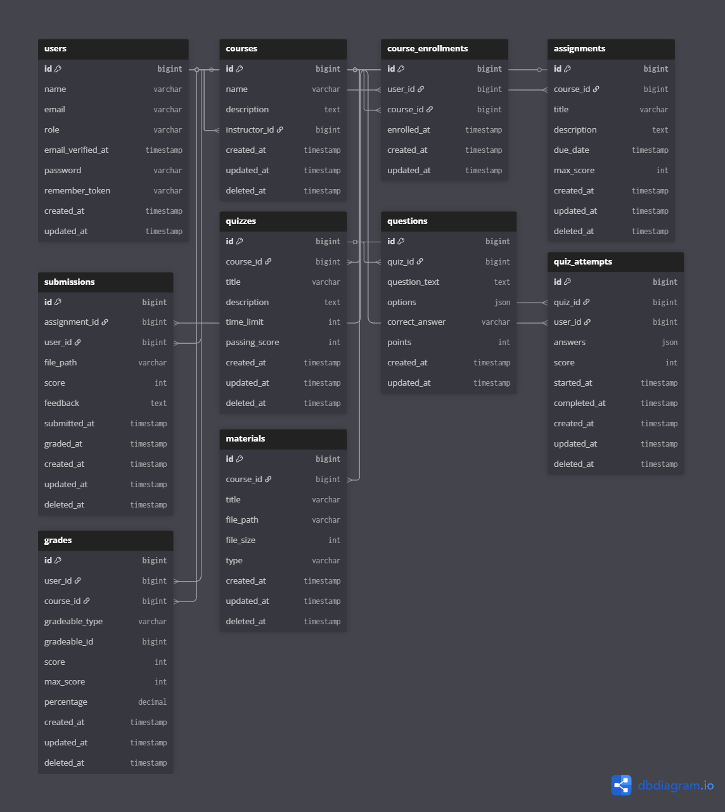

# LMS Mini - Cache Strategy Benchmarking

## Project Overview

**Nama Project:** LMS Mini - Cache Strategy Benchmarking

**Tujuan:** Menganalisis dan membandingkan strategi caching (Cache-Aside, Read-Through, Write-Through) pada Laravel Cache Abstraction Layer untuk optimasi performa data layer sistem pembelajaran.

---

## Tech Stack

| Layer         | Technology            | Version |
| ------------- | --------------------- | ------- |
| Framework     | Laravel               | 12.x    |
| PHP           | PHP                   | 8.2+    |
| Database      | MySQL                 | 8.0+    |
| Cache Backend | Redis                 | 7.x     |
| Development   | Laravel Sail (Docker) | Latest  |
| Load Testing  | Grafana K6            | Latest  |
| API Format    | REST JSON             | -       |

---

## Architecture Overview

### Strategy Comparison

| Strategy      | Data Source | get()                    | put()                      | Coupling |
| ------------- | ----------- | ------------------------ | -------------------------- | -------- |
| Cache-Aside   | Callback    | Check cache → callback   | Update cache only          | HIGH     |
| Read-Through  | Loaders     | Check cache → loader     | Invalidate cache           | LOW      |
| Write-Through | Stores      | Check cache → store.load | store.store + update cache | LOW      |
| No-Cache      | Callback    | Always callback          | Callback only              | HIGH     |

### Strategy Switching (Config-Based)

```env
# .env
CACHE_STRATEGY=cache-aside  # Options: cache-aside, read-through, write-through, no-cache
CACHE_DRIVER=redis
CACHE_TTL=3600
```
---

## Database Schema

### ERD Overview



### Data Seeding Specification

| Entity        | Count  | Notes                             |
| ------------- | ------ | --------------------------------- |
| Users         | 5,000  | 4,900 students, 100 instructors   |
| Courses       | 50     | ~100 students per course          |
| Enrollments   | ~5,000 | Random distribution               |
| Quizzes       | 250    | 5 per course                      |
| Questions     | 5,000  | 20 per quiz                       |
| Quiz Attempts | 25,000 | ~5 attempts per quiz              |
| Materials     | 500    | 10 per course                     |
| Assignments   | 250    | 5 per course                      |
| Submissions   | 12,500 | ~50 per assignment                |
| Grades        | 37,500 | Combined quiz + assignment grades |

---

## Caching Strategy Implementation

### 1. Cache-Aside (Lazy Loading)

**Karakteristik:** Aplikasi yang mengontrol cache secara eksplisit menggunakan callback.

```php
// Usage - callback required
$quiz = $cache->get('quiz:123', fn() => Quiz::find(123));

// Implementation
public function get(string $key, callable $callback): mixed
{
    if ($cached = Cache::get($key)) {
        return $cached;
    }

    $value = $callback();
    Cache::put($key, $value, $this->ttl);

    return $value;
}
```

### 2. Read-Through (with Loaders)

**Karakteristik:** Cache layer yang transparan dengan pre-configured loaders. Tidak perlu callback

```php
// CacheLoaderInterface
interface CacheLoaderInterface
{
    public function supports(string $key): bool;  // Can handle this key?
    public function load(string $key): mixed;     // Fetch from database
}

// QuizCacheLoader implementation
class QuizCacheLoader extends BaseCacheLoader
{
    protected string $prefix = 'quiz';

    public function supports(string $key): bool
    {
        return str_starts_with($key, 'quiz:') || $key === 'quizzes:all';
    }

    public function load(string $key): mixed
    {
        if ($key === 'quizzes:all') {
            return $this->quizRepository->getAllWithCourse();
        }

        $id = $this->extractId($key);
        $subkey = $this->extractSubkey($key);

        return match ($subkey) {
            'with-questions' => $this->quizRepository->findWithQuestionsAndCourse($id),
            'questions' => $this->quizRepository->getQuestions($id),
            default => $this->quizRepository->find($id),
        };
    }
}

// Usage - NO callback needed!
$quiz = $cache->get('quiz:123');
$questions = $cache->get('quiz:123:questions');
$allQuizzes = $cache->get('quizzes:all');

// Write invalidates cache (next read will fetch fresh data)
$cache->put('quiz:123', $quiz);  // Invalidates, doesn't update
```

### 3. Write-Through (with Stores)

**Karakteristik:** Synchronous write ke database DAN cache menggunakan pre-configured stores.

```php
// CacheStoreInterface (extends CacheLoaderInterface)
interface CacheStoreInterface extends CacheLoaderInterface
{
    public function store(string $key, mixed $value): void;  // Save to database
    public function erase(string $key): void;                // Delete from database
}

// QuizCacheStore implementation
class QuizCacheStore extends BaseCacheStore
{
    public function store(string $key, mixed $value): void
    {
        if ($value instanceof Quiz) {
            $value->save();  // Eloquent model save
            return;
        }

        $id = $this->extractId($key);
        if ($id > 0 && is_array($value)) {
            $this->quizRepository->update($id, $value);
        }
    }

    public function erase(string $key): void
    {
        $id = $this->extractId($key);
        if ($id > 0) {
            $this->quizRepository->delete($id);
        }
    }
}

// Usage - NO callback needed!
$quiz = $cache->get('quiz:123');           // Store.load() on miss
$cache->put('quiz:123', $quiz);            // Store.store() + cache update
$cache->forget('quiz:123');                // Store.erase() + cache delete
```

### 4. No-Cache (Baseline)

**Karakteristik:** Tidak ada caching - semua request langsung ke database. Digunakan sebagai baseline benchmark.

```php
// Usage - callback required (always executed)
$quiz = $cache->get('quiz:123', fn() => Quiz::find(123));

// Implementation
public function get(string $key, callable $callback): mixed
{
    return $callback();  // Always hit database
}
```

---

## API Endpoints

### Quiz Module (Read-Heavy)

| Method | Endpoint                                        | Description                    | Cache Behavior     |
| ------ | ----------------------------------------------- | ------------------------------ | ------------------ |
| GET    | `/api/quizzes`                                  | List all quizzes               | Cached             |
| GET    | `/api/quizzes/{id}`                             | Get quiz detail with questions | Cached             |
| GET    | `/api/quizzes/{id}/questions`                   | Get questions for quiz         | Cached             |
| POST   | `/api/quizzes/{id}/attempts`                    | Start quiz attempt             | Write              |
| PUT    | `/api/quizzes/{id}/attempts/{attemptId}`        | Submit quiz answers            | Write + Invalidate |
| GET    | `/api/quizzes/{id}/attempts/{attemptId}/result` | Get attempt result             | Cached             |
| GET    | `/api/users/{userId}/quiz-attempts`             | Get user's quiz attempts       | Cached             |

### Material Module (Read-Heavy)

| Method | Endpoint                       | Description            | Cache Behavior     |
| ------ | ------------------------------ | ---------------------- | ------------------ |
| GET    | `/api/courses/{id}/materials`  | List course materials  | Cached             |
| GET    | `/api/materials/{id}`          | Get material detail    | Cached             |
| GET    | `/api/materials/{id}/download` | Download material file | Cached metadata    |
| POST   | `/api/materials`               | Upload new material    | Write + Invalidate |
| PUT    | `/api/materials/{id}`          | Update material        | Write + Invalidate |
| DELETE | `/api/materials/{id}`          | Delete material        | Write + Invalidate |

### Assignment Module (Write-Heavy)

| Method | Endpoint                                    | Description                   | Cache Behavior     |
| ------ | ------------------------------------------- | ----------------------------- | ------------------ |
| GET    | `/api/courses/{id}/assignments`             | List assignments              | Cached             |
| GET    | `/api/assignments/{id}`                     | Get assignment detail         | Cached             |
| POST   | `/api/assignments/{id}/submissions`         | Submit assignment             | Write              |
| GET    | `/api/assignments/{id}/submissions`         | List submissions (instructor) | Cached             |
| GET    | `/api/assignments/{id}/submissions/pending` | List pending submissions      | Cached             |
| GET    | `/api/assignments/{id}/statistics`          | Get assignment statistics     | Cached             |
| PUT    | `/api/submissions/{id}/grade`               | Grade submission              | Write + Invalidate |

### Gradebook Module (Mixed)

| Method | Endpoint                                  | Description              | Cache Behavior      |
| ------ | ----------------------------------------- | ------------------------ | ------------------- |
| GET    | `/api/courses/{id}/gradebook`             | Get course gradebook     | Cached (aggregated) |
| GET    | `/api/users/{id}/grades`                  | Get user's all grades    | Cached              |
| GET    | `/api/courses/{id}/users/{userId}/grades` | Get user grade in course | Cached              |
| PUT    | `/api/grades/{id}`                        | Update grade             | Write + Invalidate  |
| GET    | `/api/courses/{id}/statistics`            | Get course statistics    | Cached              |
| GET    | `/api/users/{id}/performance`             | Get user performance     | Cached              |
| GET    | `/api/courses/{id}/top-performers`        | Get top performers       | Cached              |

---

## Benchmark Scenarios

### Environment Specification

| Component | Specification    |
| --------- | ---------------- |
| VPS       | 2 vCPU, 2GB RAM  |
| OS        | Ubuntu 22.04 LTS |
| Docker    | Latest           |
| PHP       | 8.2 (FPM)        |
| MySQL     | 8.0              |
| Redis     | 7.x              |

### Workload Scenarios

#### Scenario 1: Read-Heavy (80% Read, 20% Write)

```
Concurrent Users: 100, 250, 500, 750, 1000
Duration: 5 minutes per test
Ramp-up: 60 seconds

Operations:
- 40% GET /api/quizzes/{id}
- 25% GET /api/materials/{id}
- 15% GET /api/courses/{id}/gradebook
- 10% POST /api/quizzes/{id}/attempts
- 10% POST /api/assignments/{id}/submissions
```

#### Scenario 2: Write-Heavy (40% Read, 60% Write)

```
Concurrent Users: 100, 250, 500, 750, 1000
Duration: 5 minutes per test
Ramp-up: 60 seconds

Operations:
- 20% GET /api/assignments/{id}
- 20% GET /api/courses/{id}/gradebook
- 35% POST /api/assignments/{id}/submissions
- 15% PUT /api/submissions/{id}/grade
- 10% POST /api/quizzes/{id}/attempts
```

### Metrics to Collect

| Category        | Metric                       | Tool      | Command/Method     |
| --------------- | ---------------------------- | --------- | ------------------ |
| Response Time   | Avg, Min, Max, P90, P95, P99 | K6        | Aggregate Report   |
| Throughput      | Requests/second              | K6        | Aggregate Report   |
| Error Rate      | % Failed requests            | K6        | Aggregate Report   |
| CPU Usage       | % Utilization                | htop      | Manual observation |
| Memory Usage    | Used/Available               | htop      | Manual observation |
| Disk I/O        | Read/Write IOPS, Latency     | iostat    | `iostat -dx 1`     |
| Cache Hit Ratio | Hits/Misses                  | redis-cli | `INFO stats`       |
| Query Time      | Avg query duration           | Telescope | Dashboard          |

---

## Development Commands

### Initial Setup

```bash
git clone https://github.com/Fahridanaa/lms.git
cd lms

cp .env.example .env

./vendor/bin/sail up -d

./vendor/bin/sail composer install

./vendor/bin/sail artisan key:generate

./vendor/bin/sail artisan migrate

./vendor/bin/sail artisan db:seed

./vendor/bin/sail artisan cache:clear
./vendor/bin/sail artisan config:cache
./vendor/bin/sail artisan route:cache
```

### Switching Cache Strategy

```bash
# Edit .env file
CACHE_STRATEGY=cache-aside  # Options: cache-aside, read-through, write-through, no-cache

./vendor/bin/sail artisan cache:clear
./vendor/bin/sail artisan config:clear
./vendor/bin/sail down && ./vendor/bin/sail up -d
```

### Verifying Cache Strategy

```bash
./vendor/bin/sail artisan tinker --execute="
\$strategy = app(\App\Contracts\CacheStrategyInterface::class);
echo 'Strategy Class: ' . get_class(\$strategy);
"
```

### Running Tests

```bash
# Run all cache strategy tests
./vendor/bin/sail artisan test tests/Unit/Services/Cache/

# Run specific strategy test
./vendor/bin/sail artisan test tests/Unit/Services/Cache/ReadThroughStrategyTest.php
./vendor/bin/sail artisan test tests/Unit/Services/Cache/WriteThroughStrategyTest.php
```

### Telescope Access

```
URL: http://localhost/telescope
```
