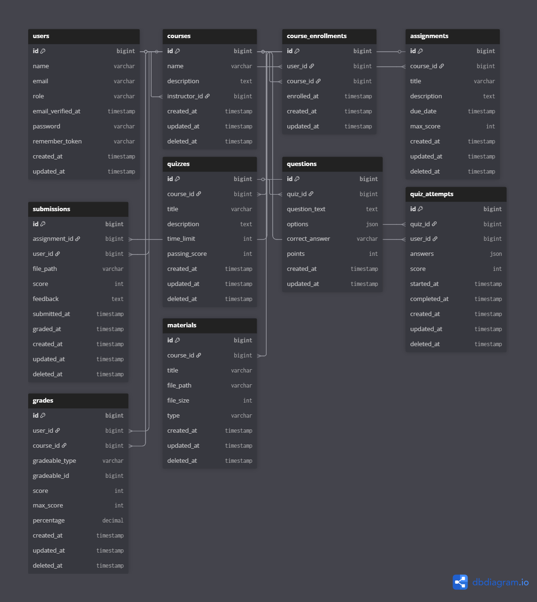

 # LMS Mini — Cache Strategy Benchmarking
 
 ## Project Overview
 
 **Project:** LMS Mini — Cache Strategy Benchmarking
 
 **Purpose:** Analyze and compare caching strategies (Cache-Aside, Read-Through, Write-Through) on the Laravel Cache abstraction layer for data-layer performance optimization of a Moodle-inspired LMS.
 
 The application models benchmark-relevant LMS complexity — course structure with ordered sections and learning modules, conditional availability, activity completion, gradebook aggregation, assignment workflow, quiz attempt lifecycle, context-based role authorization, and cascading invalidation. Complexity exists to make cache behavior realistic; the research target remains caching strategies.
 
 ---
 
 ## Tech Stack
 
 | Layer | Technology | Version |
 | --- | --- | --- |
 | Backend Framework | Laravel | 12.x |
 | PHP | PHP (FPM) | 8.2+ |
 | Database | MySQL | 8.0+ |
 | Cache Backend | Redis (standalone or cluster) | 7.x |
 | Web Server | Nginx | Alpine |
 | Development | Laravel Sail (Docker Compose) | Latest |
 | Load Testing | Grafana K6 | Latest |
 | API Format | REST JSON | — |
 
 **PHP Extensions:** `pdo_mysql`, `mbstring`, `xml`, `zip`, `bcmath`, `intl`, `opcache` (production), `redis`, `xdebug` (profiling)
 
 ---
 
 ## Architecture Overview
 
 ### Caching Strategy Comparison
 
 | Strategy | Data Source | `get()` | `put()` | `forget()` | Coupling |
 | --- | --- | --- | --- | --- | --- |
 | **Cache-Aside** | Callback | Check cache → callback → store | Update cache only | Delete from cache | HIGH |
 | **Read-Through** | Loaders | Check cache → registered `Loader.load()` | Invalidate cache (delete) | Delete from cache | LOW |
 | **Write-Through** | Stores | Check cache → registered `Store.load()` | `Store.store()` + update cache | `Store.erase()` + delete cache | LOW |
 | **No-Cache** | Callback | Always execute callback | Execute persist callback | No-op | HIGH |
 
 ### Strategy Registration
 
 Strategies are registered via `CacheStrategyServiceProvider` which binds `CacheStrategyInterface` in the container based on the `CACHE_STRATEGY` env value. Read-Through and Write-Through strategies are pre-configured with all available loaders/stores.
 
 ---
 
 ## Domain Architecture (Moodle-Inspired)
 
 ### Course Structure
 
 Courses are organized into **ordered sections** containing **learning modules** that wrap benchmarked activities (materials, quizzes, assignments). The primary learner-facing read returns a content tree with sections, modules, availability state, completion state, and activity summaries — not a flat list.
 
 ### Conditional Availability
 
 Learning modules may have **availability rules** that decide visibility for a specific user: date windows, prior module completion, minimum grade, and group membership. Instructors bypass availability rules.
 
 ### Module & Course Completion
 
 Module completion is triggered by: viewing a material, submitting an assignment, finishing a quiz attempt, or reaching a passing grade. Course completion criteria aggregate module completion, grade thresholds, and date criteria.
 
 ### Context-Based Role Authorization
 
 Access is resolved through Moodle-inspired **contexts** (system → course → module), **roles** (student, instructor, admin), and **role assignments** with ancestor walking for inherited roles. Authorization is on the hot path for all benchmarked requests.
 
 ### Assignment Workflow
 
 Submissions follow a lifecycle: draft → submitted → (returned → resubmit) → graded, with extension overrides, marker allocation, separate marker grading, and grader assignment.
 
 ### Quiz Attempt Policy
 
 Quiz attempts respect: user or group overrides, overdue handling, grace periods, attempt state transitions, review visibility rules, and delay between attempts.
 
 ---
 
 ## Database Schema
 
 ### ERD Overview
 
 
 
 ### Entity Summary
 
 | Entity | Description |
 | --- | --- |
 | `users` | 5,000 users (4,900 students, 100 instructors) |
 | `roles` / `role_assignments` | Context-based role model |
 | `capabilities` / `role_capabilities` | Permission definitions |
 | `contexts` | System/course/module context tree with materialized paths |
 | `courses` | 50 courses |
 | `course_categories` | Course category hierarchy |
 | `course_sections` | Ordered sections within courses |
 | `learning_modules` | Wraps activities (material/quiz/assignment) with ordering |
 | `course_enrollments` / `course_enrolment_methods` | Lightweight enrolment model |
 | `course_groups` / `course_group_members` / `course_groupings` | Group-based access restrictions |
 | `materials` (10/course) | Course materials with file metadata |
 | `file_records` | File context metadata (owner, type, size, hash) |
 | `quizzes` (5/course, 250 total) | Quiz definitions with overrides |
 | `questions` (20/quiz, 5,000 total) | Quiz questions |
 | `quiz_attempts` (~5/quiz, 25,000 total) | Attempt lifecycle with steps |
 | `quiz_question_slots` | Question ordering per quiz |
 | `quiz_grades` | Per-quiz grade records |
 | `quiz_overrides` | User/group attempt overrides |
 | `assignments` (5/course, 250 total) | Assignment definitions with marker config |
 | `assignment_overrides` | User/group extension overrides |
 | `assignment_allocated_markers` | Marker-to-submission assignments |
 | `assignment_marks` | Separate marker + grader scores |
 | `submissions` (~50/assignment, 12,500 total) | Submission lifecycle |
 | `module_completions` | Per-user module completion state |
 | `module_availability_rules` | Conditional availability rules |
 | `grade_categories` | Gradebook category structure |
 | `grade_items` | Gradebook columns (one per gradable activity) |
 | `grades` | Per-user grade records (37,500+) |
 | `course_completions` / `course_completion_criteria` / `course_completion_criterion_completion` | Course-level completion tracking |
 
 ---
 
 ## Caching Strategy Implementation
 
 ### Common Interface
 
 All strategies implement `App\Contracts\CacheStrategyInterface`:
 
 ```php
 interface CacheStrategyInterface
 {
     public function get(string $key, ?callable $callback = null): mixed;
     public function put(string $key, mixed $value, ?callable $persist = null): bool;
     public function forget(string $key): bool;
     public function remember(string $key, ?callable $callback = null): mixed;
     public function tags(array $tags): self;
     public function flushTags(array $tags): bool;
 }
 ```
 
 ### 1. Cache-Aside (Lazy Loading)
 
 Application explicitly manages cache via callbacks.
 
 ```php
 // Usage — callback required
 $quiz = $cache->get('quiz:123', fn() => Quiz::find(123));
 
 // Tags for grouped invalidation
 $cache->tags(['quizzes', "quiz:{$id}"])->get("quiz:{$id}", $callback);
 
 // put() updates cache only (DB write handled separately)
 $cache->put('quiz:123', $quiz);
 ```
 
 ### 2. Read-Through (with Loaders)
 
 Cache layer transparently fetches data from database via pre-registered loaders. No callback needed.
 
 ```php
 // CacheLoaderInterface
 interface CacheLoaderInterface
 {
     public function supports(string $key): bool;  // Can this loader handle this key?
     public function load(string $key): mixed;     // Fetch from database
 }
 
 // Registered loaders: Quiz, Material, Assignment, Attempt, Course, User, Submission
 
 // Usage — no callback needed (loader-first)
 $quiz = $cache->get('quiz:123');            // QuizCacheLoader.load()
 $questions = $cache->get('quiz:123:questions');
 $allQuizzes = $cache->get('quizzes:all');
 
 // If no loader supports the key, falls back to callback
 $data = $cache->get('custom:key', fn() => fetchData());
 
 // put() invalidates cache (next read fetches fresh data)
 $cache->put('quiz:123', $quiz);  // Deletes from cache, doesn't update
 ```
 
 ### 3. Write-Through (with Stores)
 
 Synchronous write to both database and cache via pre-registered stores.
 
 ```php
 // CacheStoreInterface (extends CacheLoaderInterface)
 interface CacheStoreInterface extends CacheLoaderInterface
 {
     public function store(string $key, mixed $value): void;  // Save to database
     public function erase(string $key): void;                // Delete from database
 }
 
 // Registered stores: Quiz, Material, Assignment, Attempt, Course, User, Submission
 
 // Usage — no callback needed
 $cache->put('quiz:123', $quiz);             // Store.store() + cache update
 $quiz = $cache->get('quiz:123');            // Store.load() on miss
 $cache->forget('quiz:123');                 // Store.erase() + cache delete
 ```
 
 ### 4. No-Cache (Baseline)
 
 No caching — all requests hit the database directly. Used as benchmark baseline.
 
 ```php
 // Usage — callback always executed
 $quiz = $cache->get('quiz:123', fn() => Quiz::find(123));
 ```
 
 ### Cache Key Convention
 
 ```text
 {prefix}:{entity}:{id}:{subkey?}
 Examples:
   lms:quiz:123
   lms:quiz:123:questions
   lms:course:1:user:2:grades
   lms:course:1:structure:42
 ```
 
 Prefix defaults to `lms` and is configurable via `CACHE_PREFIX` env.
 
 ---
 
 ## API Endpoints
 
 All endpoints return `{ success: bool, data: ... }` wrapped via `ApiResponseTrait`. Authentication is via `X-User-Id` header (benchmark persona). Every read checks context-based authorization.
 
 ### Course Structure (Primary Learner Read)
 
 | Method | Endpoint | Description | Cache Behavior |
 | --- | --- | --- | --- |
 | GET | `/api/courses/{courseId}/structure` | Sections → modules → activity summaries with availability/completion | Cached (actor-specific) |
 | GET | `/api/courses/{courseId}/completion` | User's course completion progress | Cached |
 
 ### Quiz Module (Read-Heavy)
 
 | Method | Endpoint | Description | Cache Behavior |
 | --- | --- | --- | --- |
 | GET | `/api/quizzes` | List all quizzes (filtered by access) | Cached |
 | GET | `/api/quizzes/{id}` | Quiz detail with questions | Cached |
 | GET | `/api/quizzes/{id}/questions` | Questions for quiz | Cached |
 | POST | `/api/quizzes/{id}/attempts` | Start quiz attempt | Write |
 | PUT | `/api/quizzes/{quizId}/attempts/{attemptId}` | Submit quiz answers | Write + Invalidate |
 | GET | `/api/quizzes/{quizId}/attempts/{attemptId}/result` | Attempt result | Cached |
 | GET | `/api/users/{userId}/quiz-attempts` | User's quiz attempts | Cached |
 
 ### Material Module (Read-Heavy)
 
 | Method | Endpoint | Description | Cache Behavior |
 | --- | --- | --- | --- |
 | GET | `/api/courses/{courseId}/materials` | List course materials (actor-filtered) | Cached |
 | GET | `/api/materials/{id}` | Material detail | Cached |
 | GET | `/api/materials/{id}/download` | Download material file | Write (triggers completion) |
 | POST | `/api/materials` | Upload material | Write + Invalidate |
 | PUT | `/api/materials/{id}` | Update material | Write + Invalidate |
 | DELETE | `/api/materials/{id}` | Delete material | Write + Invalidate |
 
 ### Assignment Module (Write-Heavy)
 
 | Method | Endpoint | Description | Cache Behavior |
 | --- | --- | --- | --- |
 | GET | `/api/courses/{courseId}/assignments` | List assignments (actor-filtered) | Cached |
 | GET | `/api/assignments/{id}` | Assignment detail | Cached |
 | POST | `/api/assignments/{id}/submissions` | Submit assignment | Write |
 | GET | `/api/assignments/{id}/submissions` | List submissions (instructor) | Cached |
 | GET | `/api/assignments/{id}/submissions/pending` | Pending submissions | Cached |
 | GET | `/api/assignments/{id}/statistics` | Assignment statistics | Cached |
 | PUT | `/api/submissions/{id}/grade` | Grade submission | Write + Invalidate |
 | PUT | `/api/submissions/{id}/return` | Return submission for revision | Write + Invalidate |
 | PUT | `/api/submissions/{id}/reopen` | Reopen submission | Write + Invalidate |
 | PUT | `/api/submissions/{id}/marker-grade` | Marker grade submission | Write + Invalidate |
 
 ### Gradebook Module (Mixed)
 
 | Method | Endpoint | Description | Cache Behavior |
 | --- | --- | --- | --- |
 | GET | `/api/courses/{courseId}/gradebook` | Course gradebook (instructor) | Cached (aggregated) |
 | GET | `/api/users/{userId}/grades` | User's all grades | Cached |
 | GET | `/api/courses/{courseId}/users/{userId}/grades` | User grades in course | Cached |
 | PUT | `/api/grades/{id}` | Update grade | Write + Invalidate |
 | GET | `/api/courses/{courseId}/statistics` | Course statistics | Cached |
 | GET | `/api/users/{userId}/performance` | User performance summary | Cached |
 | GET | `/api/courses/{courseId}/top-performers` | Top performers | Cached |
 
 ---
 
 ## Benchmark Scenarios
 
 ### Environment Specification
 
 | Component | Specification |
 | --- | --- |
 | Server | 2 vCPU, 2GB RAM |
 | OS | Ubuntu 22.04 LTS |
 | Docker Compose | Latest |
 | App Server | PHP 8.2 FPM (Nginx) |
 | PHP-FPM Tuning | `pm.max_children=64`, `pm.start_servers=16`, `pm.max_requests=500` |
 | OPcache | Enabled (`memory_consumption=128`, `validate_timestamps=0`) |
 | MySQL | 8.0 (InnoDB buffer pool 2GB, max connections 300) |
 | Redis | 7.x standalone (256mb maxmemory, allkeys-lru) |
 | Redis Cluster | 6 nodes (3 masters + 3 replicas) via `docker compose --profile redis-cluster up -d` |
 
 ### Benchmark Personas
 
 Traffic uses **actor-aware** requests with valid LMS relationships:
 - **Student:** reads course structure, materials, quizzes; submits quizzes and assignments; triggers completion
 - **Instructor:** reads gradebooks, submissions, statistics; grades submissions; updates grades
 - **Controlled expected failures:** restricted/hidden modules, suspended students, non-enrolled users, locked grade updates
 
 ### Workload Scenarios
 
 #### Scenario 1: Read-Heavy (80% Read, 20% Write)
 
 ```text
 Concurrent Users: 100, 250, 500, 750, 1000
 Duration: 6.5 min per test (1m ramp-up, 5m steady, 30s ramp-down)
 
 Operations:
  25% - GET  /api/courses/{id}/structure                (course structure)
  12% - GET  /api/courses/{id}/gradebook                (gradebook)
  10% - GET  /api/materials/{id}                        (material detail)
  10% - POST /api/quizzes/{id}/attempts                 (start quiz attempt)
  10% - POST /api/assignments/{id}/submissions          (submit assignment)
   8% - GET  /api/assignments/{id}                      (assignment detail)
   5% - GET  /api/quizzes/{id}                          (quiz detail)
   5% - GET  /api/users/{id}/grades                     (user grades)
   3% - GET  /api/quizzes/{id}/attempts/{id}/result     (attempt result)
   3% - GET  /api/courses/{id}/materials                (material list)
   2% - GET  /api/courses/{id}/completion               (course completion)
   7% - Expected failure (restricted/hidden/suspended)   (controlled errors)
 -------------------------------------------------------
 Total: 80% read (incl. 7% controlled failures), 20% write
 ```
 
 #### Scenario 2: Write-Heavy (40% Read, 60% Write)
 
 ```text
 Concurrent Users: 100, 250, 500, 750, 1000
 Duration: 6.5 min per test (1m ramp-up, 5m steady, 30s ramp-down)
 
 Operations:
  20% - POST /api/assignments/{id}/submissions          (submit assignment)
  15% - Quiz submit chain: start → PUT answers          (quiz attempt)
  10% - GET  /api/courses/{id}/structure                (course structure)
  10% - GET  /api/courses/{id}/gradebook                (gradebook)
  10% - PUT  /api/grades/{id}                           (grade update)
   5% - GET  /api/assignments|quiz|material/{id}        (activity detail)
   5% - GET  /api/users/{id}/grades|performance         (user grades/perf)
   5% - Cascade: structure → material DL → structure    (read→write→read)
   5% - PUT  /api/submissions/{id}/grade                (grade submission)
   5% - PUT  /api/submissions/{id}/marker-grade         (marker grade)
   5% - GET  /api/materials/{id}/download               (trigger completion)
   5% - Expected failure (locked grades/unauthorized)    (controlled errors)
 -------------------------------------------------------
 Total: 40% read, 60% write
 ```
 
 ### Metrics to Collect
 
 | Category | Metric | Tool / Method |
 | --- | --- | --- |
 | Response Time | Avg, Min, Med, Max, P90, P95, P99 | K6 (per-endpoint trends) |
 | Throughput | Requests/second | K6 aggregate |
 | Error Rate | % Failed (unexpected) vs controlled | K6 thresholds (`ef` tag) |
 | CPU Usage | % Utilization | `htop`, container stats |
 | Memory | Used/Available | `htop`, container stats |
 | Cache Hit Ratio | Hits/Misses | `redis-cli INFO stats` |
 | Query Time | Avg query duration | Telescope dashboard |
 | ANOVA / Tukey HSD | Statistical significance | Scripts in `scripts/` |
 
 ### Running Benchmarks
 
 ```bash
 # Prepare benchmark (seed data, generate k6 fixtures)
 ./scripts/prepare-benchmark.sh
 
 # Run single scenario
 CACHE_STRATEGY=cache-aside ./scripts/run-benchmark.sh read-heavy 100
 CACHE_STRATEGY=read-through ./scripts/run-benchmark.sh write-heavy 500
 
 # Run all strategies across all VU levels
 ./scripts/run-all-benchmarks.sh
 
 # Run with Redis Cluster
 REDIS_CLUSTER_MODE=true ./scripts/run-all-benchmarks.sh
 
 # Analyze results
 ./scripts/analyze-results.sh benchmark-results/
 # Aggregate across runs
 php scripts/combine-benchmark-results.php
 ```
 
 ---
 
 ## Redis Configuration
 
 ### Standalone Mode (Default)
 
 Single Redis node with 256mb maxmemory, allkeys-lru eviction policy, not exposed to host.
 
 ### Cluster Mode (6 nodes: 3 masters + 3 replicas)
 
 ```bash
 # Start cluster profile
 docker compose --profile redis-cluster up -d
 
 # Set environment
 REDIS_CLUSTER_MODE=true
 REDIS_CLUSTER_HOSTS=redis-c1,redis-c2,redis-c3
 REDIS_CLUSTER_PORT=6379
 ```
 
 Each cluster node: Redis 7 Alpine, 256mb maxmemory, allkeys-lru, AOF enabled.
 
 ---
 
 ## Development Commands
 
 ### Initial Setup
 
 ```bash
 git clone https://github.com/Fahridanaa/lms.git
 cd lms
 
 cp .env.example .env
 # Edit .env: DB_*, CACHE_*, APP_KEY (or let key:generate set it)
 
 ./vendor/bin/sail up -d
 ./vendor/bin/sail composer install
 ./vendor/bin/sail artisan key:generate
 ./vendor/bin/sail artisan migrate
 ./vendor/bin/sail artisan db:seed
 ```
 
 ### Switching Cache Strategy
 
 ```bash
 # Edit .env
 CACHE_STRATEGY=cache-aside  # Options: cache-aside, read-through, write-through, no-cache
 
 ./vendor/bin/sail artisan config:clear
 # For Redis standalone: restart to flush cache
 ./vendor/bin/sail down && ./vendor/bin/sail up -d
 ```
 
 ### Verifying Cache Strategy
 
 ```bash
 ./vendor/bin/sail artisan tinker --execute="
 \$strategy = app(\App\Contracts\CacheStrategyInterface::class);
 echo 'Strategy Class: ' . get_class(\$strategy);
 "
 ```
 
 ### Running Tests
 
 ```bash
 # Run all cache strategy unit tests
 ./vendor/bin/sail artisan test tests/Unit/Services/Cache/
 
 # Run specific strategy test
 ./vendor/bin/sail artisan test tests/Unit/Services/Cache/ReadThroughStrategyTest.php
 ./vendor/bin/sail artisan test tests/Unit/Services/Cache/WriteThroughStrategyTest.php
 ./vendor/bin/sail artisan test tests/Unit/Services/Cache/CacheAsideStrategyTest.php
 ./vendor/bin/sail artisan test tests/Unit/Services/Cache/NoCacheStrategyTest.php
 
 # Run cache loader/store tests
 ./vendor/bin/sail artisan test tests/Unit/Services/Cache/CourseCacheLoaderTest.php
 ./vendor/bin/sail artisan test tests/Unit/Services/Cache/UserCacheLoaderTest.php
 ./vendor/bin/sail artisan test tests/Unit/Services/Cache/AuthorizationCacheTest.php
 ./vendor/bin/sail artisan test tests/Unit/Services/Cache/CapabilityCacheTest.php
 ./vendor/bin/sail artisan test tests/Unit/Services/Cache/CourseCompletionCacheTest.php
 
 # Run benchmark result tests
 ./vendor/bin/sail artisan test tests/Unit/CombineBenchmarkResultsScriptTest.php
 ./vendor/bin/sail artisan test tests/Unit/BenchmarkResultsServiceTest.php
 ./vendor/bin/sail artisan test tests/Unit/RedisClusterConfigTest.php
 ```
 
 ### Telescope Access
 
 ```text
 URL: http://localhost/telescope
 ```
 
 ---
 
 ## Project Structure
 
 ```text
 app/
 ├── Contracts/
 │   ├── CacheStrategyInterface.php   # Unified cache strategy contract
 │   ├── CacheLoaderInterface.php     # Read-Through loader contract
 │   └── CacheStoreInterface.php      # Write-Through store contract
 ├── Services/
 │   ├── Cache/
 │   │   ├── CacheAsideStrategy.php
 │   │   ├── ReadThroughStrategy.php
 │   │   ├── WriteThroughStrategy.php
 │   │   ├── NoCacheStrategy.php
 │   │   ├── Loaders/                 # Quiz, Material, Assignment, Attempt, Course, User, Submission
 │   │   └── Stores/                  # Quiz, Material, Assignment, Attempt, Course, User, Submission
 │   ├── QuizService.php
 │   ├── AssignmentService.php
 │   ├── MaterialService.php
 │   ├── GradebookService.php
 │   ├── CourseStructureService.php
 │   ├── CourseAccessService.php      # Authorization + enrolment
 │   ├── AuthorizationService.php     # Context-based role resolution
 │   ├── ModuleAvailabilityService.php
 │   ├── ModuleCompletionService.php
 │   ├── CourseCompletionService.php
 │   ├── ContextService.php
 │   ├── ActorResolver.php
 │   └── BenchmarkResultsService.php
 ├── Models/                          # 40+ Eloquent models
 ├── Http/Controllers/Api/            # Quiz, Assignment, Material, Gradebook, CourseStructure, CourseCompletion
 ├── Providers/
 │   └── CacheStrategyServiceProvider.php
 ├── Jobs/
 │   └── EvaluateCourseCompletion.php
 └── Constants/Messages/              # QuizMessage, AssignmentMessage, MaterialMessage, GradeMessage
 
 config/
 ├── caching-strategy.php             # Strategy driver, TTL, prefix, strategy descriptions
 └── cache.php                        # Standard Laravel cache config
 
 database/
 ├── migrations/                      # 55+ migration files
 └── seeders/
     └── DatabaseSeeder.php           # Deterministic varied dataset
 
 tests/
 ├── Unit/Services/Cache/             # Strategy, loader, store, authorization tests
 ├── Feature/Api/                     # API endpoint integration tests
 ├── Feature/Performance/             # Performance-oriented tests
 ├── Feature/Services/                # Service layer tests
 └── Benchmark/k6/                    # k6 load test scripts
     ├── read-heavy-scenario.js
     ├── write-heavy-scenario.js
     └── fixtures.js                  # Pre-generated relationship-valid targets
 
 scripts/                             # Benchmark orchestration & analysis
 ├── run-benchmark.sh
 ├── run-all-benchmarks.sh
 ├── prepare-benchmark.sh
 ├── analyze-results.sh
 ├── combine-benchmark-results.php
 ├── switch-strategy.sh
 ├── setup-redis-cluster.sh
 └── ...                              # 20+ automation scripts
 
 docs/
 ├── erd.png                          # Entity Relationship Diagram
 ├── thesis-evidence.md
 ├── cpu-bottleneck-analysis.md
 └── ...                              # Analysis documents
 
 benchmark-results/                   # Raw per-run benchmark data
 benchmark-results-combined/          # Aggregated statistical analysis (ANOVA, Tukey)
 ```
 
